# Fabric Hackathon Guide

> ← Back to [main README](../README.md)

This guide walks you through connecting **Microsoft Fabric** to the IoT Hub deployed by the [IoT Simulator Setup](IOT_SIMULATOR_SETUP.md), creating an EventStream with an aggregation transform, and routing the data to an Eventhouse for real-time analytics.

## Prerequisites

- IoT Simulator deployed and sending data (see [IoT Simulator Setup](IOT_SIMULATOR_SETUP.md))
- A [Microsoft Fabric](https://www.microsoft.com/microsoft-fabric) workspace with at least **Contributor** access
- IoT Hub connection string (from the `iothubowner` shared access policy)

---

## Step 1 — Create a New EventStream

1. In your Fabric workspace, click **+ New** → **Eventstream**.
2. Enter a name for your EventStream (e.g., `eventstream-team01`) and click **Create**.

   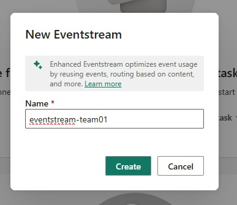

---

## Step 2 — Connect IoT Hub as a Data Source

1. On the EventStream design canvas, select **Connect data sources**.

   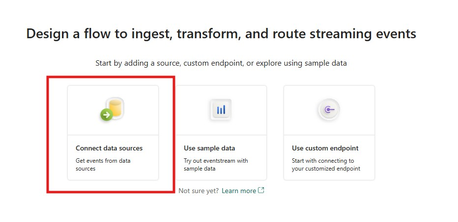

2. Select **Azure IoT Hub** from the recommended sources.

   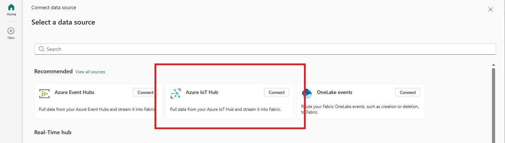

---

## Step 3 — Get IoT Hub Connection Details from Azure Portal

Before configuring the connection in Fabric, you'll need to grab credentials from the Azure portal.

### 3a. Find your IoT Hub

Open your IoT Hub (`<prefix>-iothub`) in the [Azure portal](https://portal.azure.com).

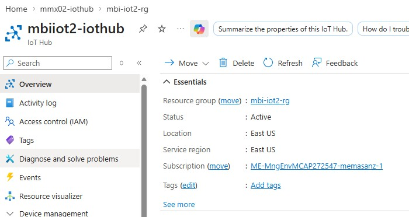

### 3b. Get the Shared Access Key

1. In the left navigation, under **Security settings**, click **Shared access policies**.

   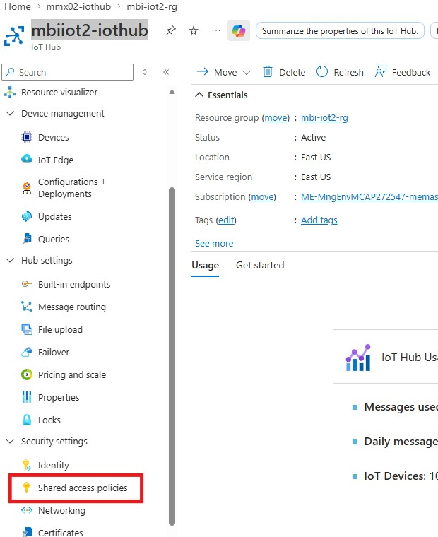

2. Click the **iothubowner** policy.

   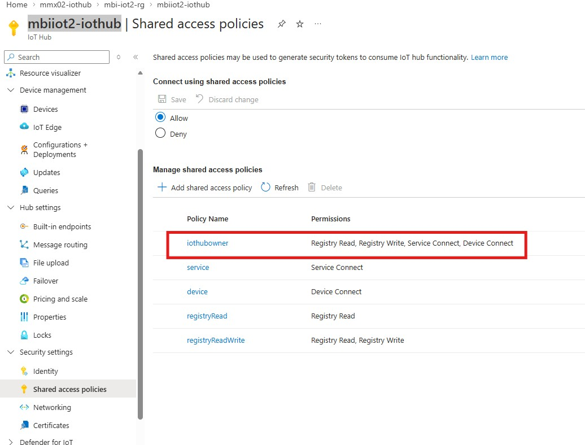

3. Copy the **Primary key** (you'll need this in the next step).

   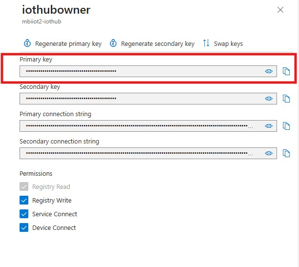

### 3c. Note your Consumer Group

1. In the left navigation, under **Hub settings**, click **Built-in endpoints**.
2. Under **Consumer Groups**, note the consumer group for your team (e.g., `team1`, `team2`).

   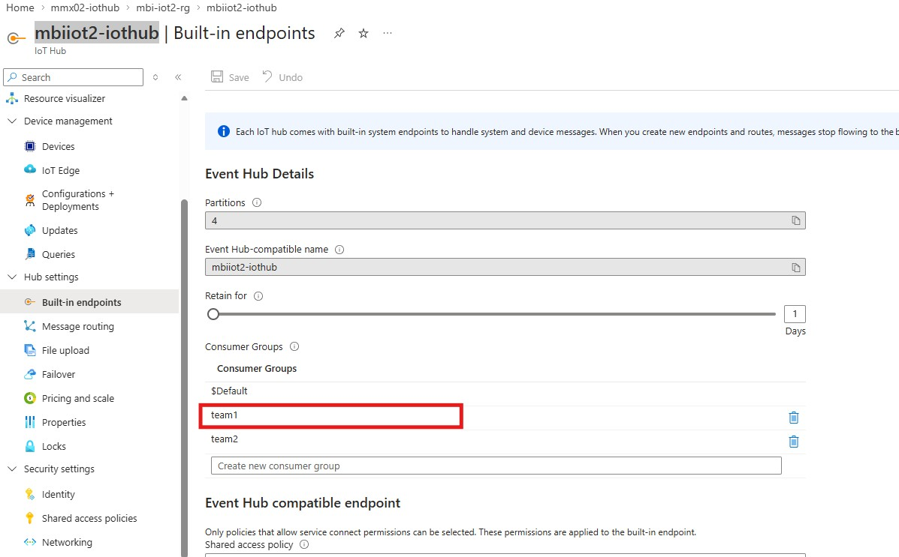

> **Tip:** Each team should use a different consumer group so they can read independently without affecting each other.

---

## Step 4 — Configure the IoT Hub Connection in Fabric

1. Back in Fabric, on the **Configure connection settings** page, click **New connection**.
2. Enter your IoT Hub name and configure the connection credentials:

   | Setting | Value |
   |---|---|
   | **IoT Hub** | `<prefix>-iothub` |
   | **Authentication kind** | Shared Access Key |
   | **Shared access key name** | `iothubowner` |
   | **Shared access key** | *(paste the Primary key you copied)* |
   | **Privacy Level** | Organizational |

   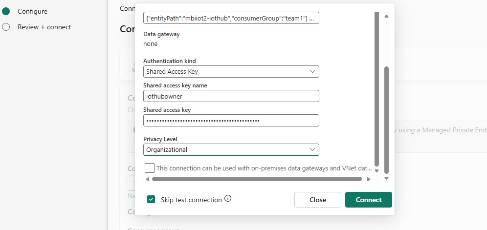

3. Check **Skip test connection** and click **Connect**.

   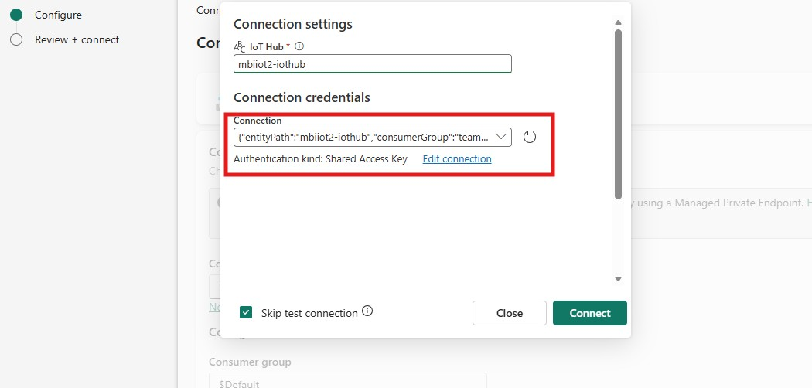

4. Set the **Consumer group** to your team's consumer group (e.g., `team1`) and leave **Data format** as `Json`.

   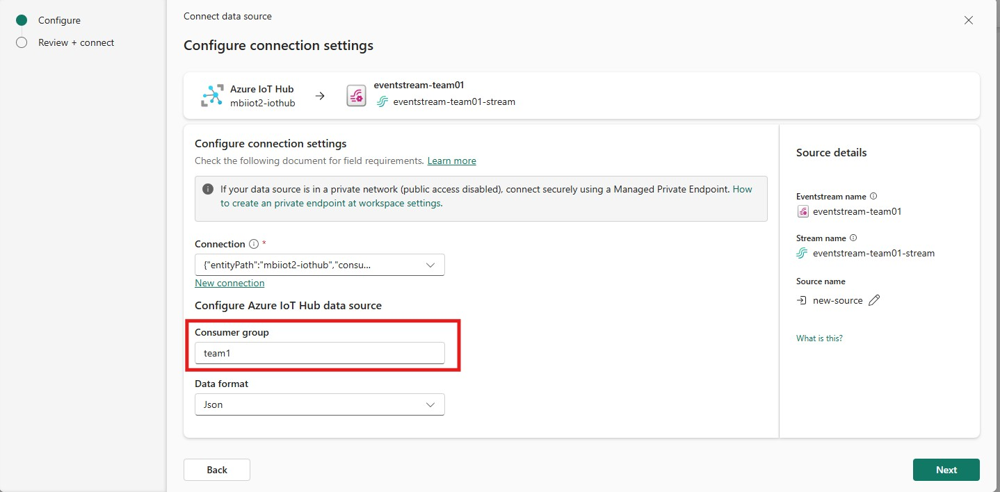

5. Click **Next** to review the connection summary, then click **Add**.

   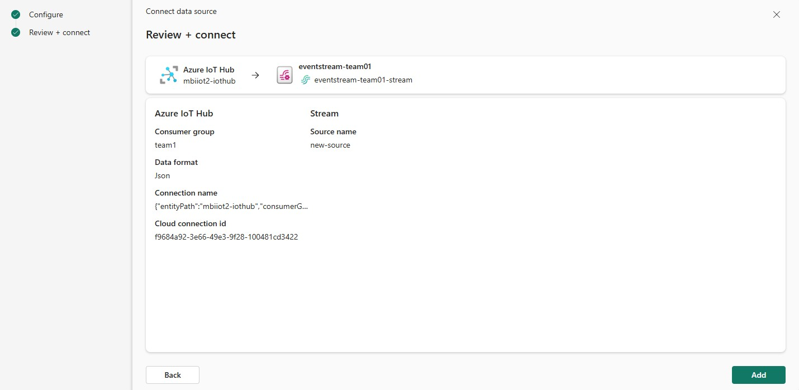

---

## Step 5 — Verify Data is Flowing

After adding the source, switch to **Edit** mode. You should see the EventStream canvas with your IoT Hub source connected. Click the stream node and check the **Data preview** tab at the bottom to confirm telemetry events are arriving.

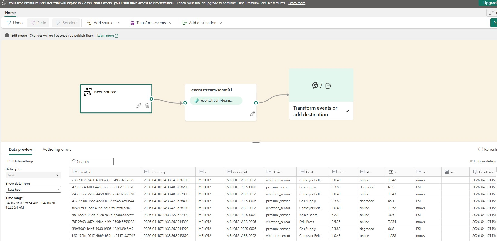

You should see columns like `event_id`, `timestamp`, `device_id`, `device_type`, `location`, `value`, `unit`, `anomaly`, `latitude`, `longitude`, etc.

---

## Step 6 — Add an Aggregate Transform

Now we'll add a transformation that calculates a **rolling sum of sensor values partitioned by anomaly type** over the last day.

1. In **Edit** mode, click the **Transform events** menu on the ribbon and select **Aggregate**. This inserts an Aggregate operator on the canvas.

2. Connect the stream node to the Aggregate node by dragging from the stream's output to the Aggregate's input.

3. Select the **Aggregate** node and configure it in the right pane:

   | Setting | Value |
   |---|---|
   | **Operation name** | `Aggregate` |
   | **Type** | `Sum` |
   | **Field** | `value` |
   | **Name** | `SUM_value` |
   | **Partition by** | `anomaly` |
   | **Aggregate values within the last** | `1 Day` |

   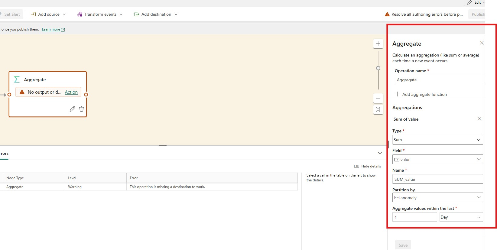

> **Note:** This creates a rolling 1-day window that sums sensor values, partitioned by anomaly type. Each time a new event arrives, Fabric recalculates the sum looking back over the last 24 hours.

---

## Step 7 — Add an Eventhouse Destination

1. Click the **+** on the Aggregate node's output and select **Eventhouse** from the Destinations list.

   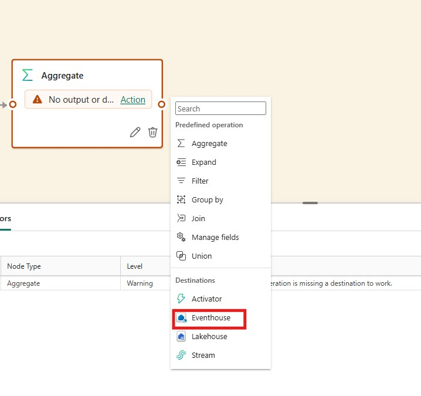

2. Configure the Eventhouse destination:

   | Setting | Value |
   |---|---|
   | **Data ingestion mode** | Event processing before ingestion |
   | **Destination name** | `Eventhouse` |
   | **Workspace** | *(select your workspace)* |
   | **Eventhouse** | *(select existing or create new)* |

   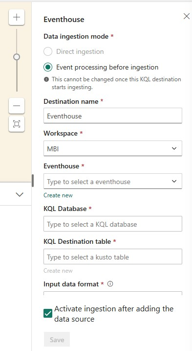

3. If you don't have an Eventhouse yet, click **Create new** and enter a name (e.g., `Team01`).

   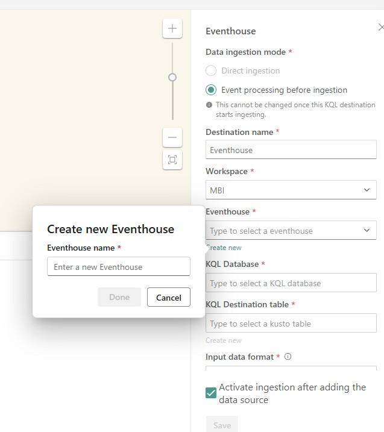

4. Select your **KQL Database** (created automatically with the Eventhouse) and enter a **KQL Destination table** name. Set **Input data format** to `Json`.

   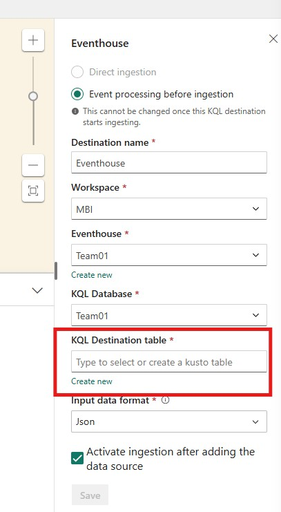

5. Ensure **Activate ingestion after adding the data source** is checked, then click **Save**.

---

## Step 8 — Publish the EventStream

Click the **Publish** button on the ribbon to deploy your EventStream pipeline.

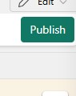

---

## Step 9 — Verify the Pipeline

After publishing, switch to **Live** view. You should see the full pipeline:

**Source** → **Aggregate** → **Eventhouse**

The bottom pane shows the Eventhouse details, including the linked Kusto item and table.

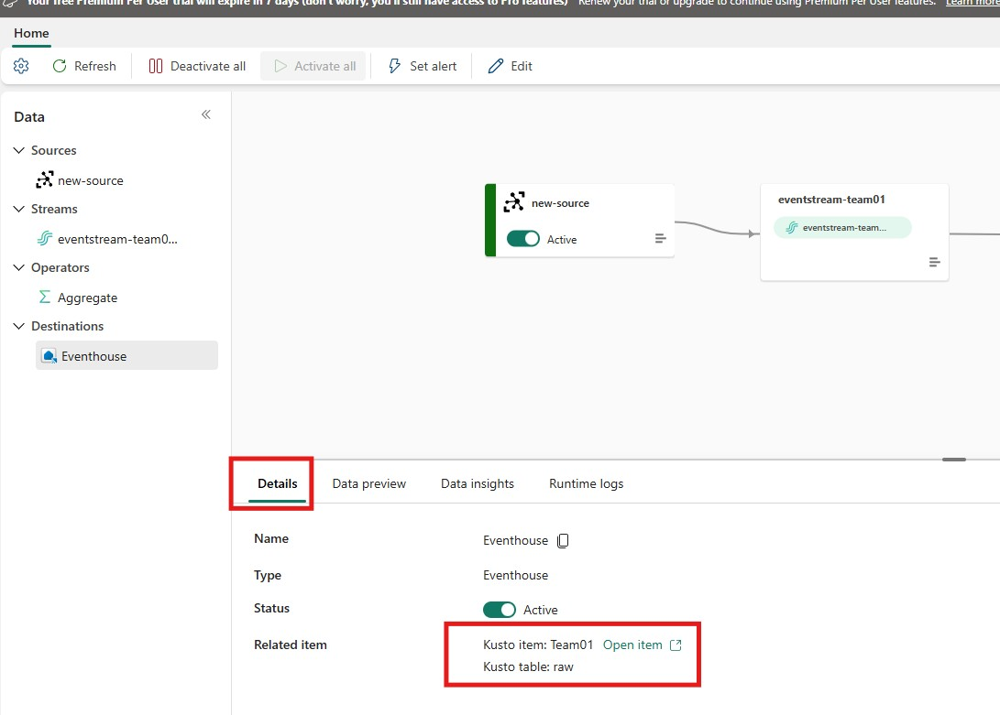

Click **Open item** next to the Kusto item to open the Eventhouse and query your aggregated data using KQL.

---

## Next Steps

- **Query your data** — Open the KQL Database and run queries against your table
- **Build a dashboard** — Create a Real-Time Dashboard from your KQL queries
- **Add more transforms** — Try adding a **Filter** (e.g., only anomalies) or **Group by** (e.g., by device type with a tumbling window)
- **Explore AI** — See the [AI Hackathon Guide](AI_HACKATHON.md) for building AI-powered experiences over the data

## References

- [Microsoft Fabric Real-Time Intelligence tutorial](https://learn.microsoft.com/en-us/fabric/real-time-intelligence/tutorial-1-resources)
- [EventStream overview](https://learn.microsoft.com/en-us/fabric/real-time-intelligence/event-streams/overview)
- [Process events using the event processor editor](https://learn.microsoft.com/en-us/fabric/real-time-intelligence/event-streams/process-events-using-event-processor-editor)
- [Add Azure IoT Hub as source in Real-Time Hub](https://learn.microsoft.com/en-us/fabric/real-time-hub/add-source-azure-iot-hub)
- [Microsoft Fabric documentation](https://learn.microsoft.com/en-us/fabric/)
- [Azure IoT Hub documentation](https://learn.microsoft.com/en-us/azure/iot-hub/)
